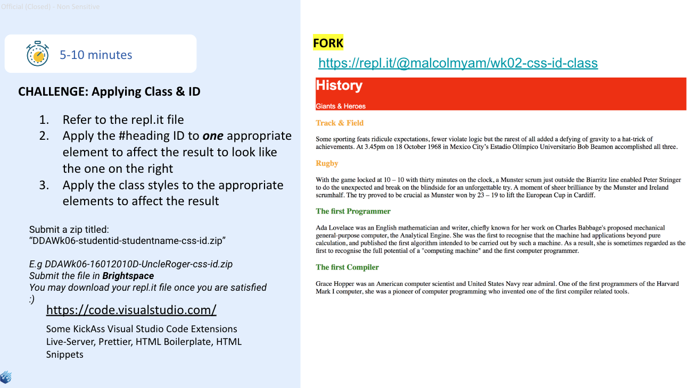

# DDA CA07 
Reference: [Sample Repl](https://repl.it/@malcolmyam/wk02-css-id-class)

## Instructions 
- Refer to the repl.it file
- Apply the #heading ID to one appropriate element to affect the result to look like the one on the right
- Apply the class styles to the appropriate elements to affect the result

## Submission
- Submit a zip titled: `“DDAWk06-studentid-studentname-css-id.zip”`
- `E.g DDAWk06-16012010D-UncleRoger-css-id.zip`
- Submit the file in Brightspace
- You may download your repl.it file once you are satisfied :) 

  

