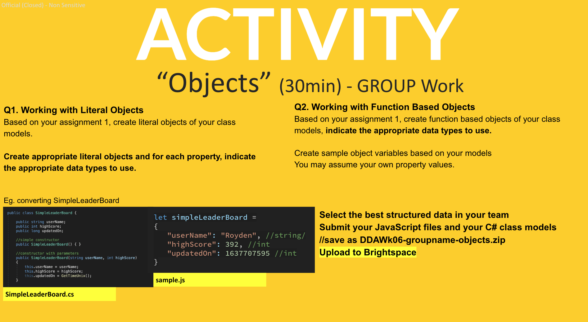

# DDA CA08

## Q1. Working with Literal Objects
Based on your assignment 1, create `literal objects` of your class models. 

Create appropriate literal objects and for each property, indicate the appropriate data types to use.

Eg. converting SimpleLeaderBoard

## Q2. Working with Function Based Objects
Based on your assignment 1, create `function based objects` of your class models, indicate the appropriate data types to use. 

Create sample object variables based on your models
You may assume your own property values. 

## Submission
- Include your group member names
- Select the best structured data in your team
- Submit your JavaScript files and your C# class models
- save as `DDAWk06-groupname-objects.zip`
- Upload to Brightspace

